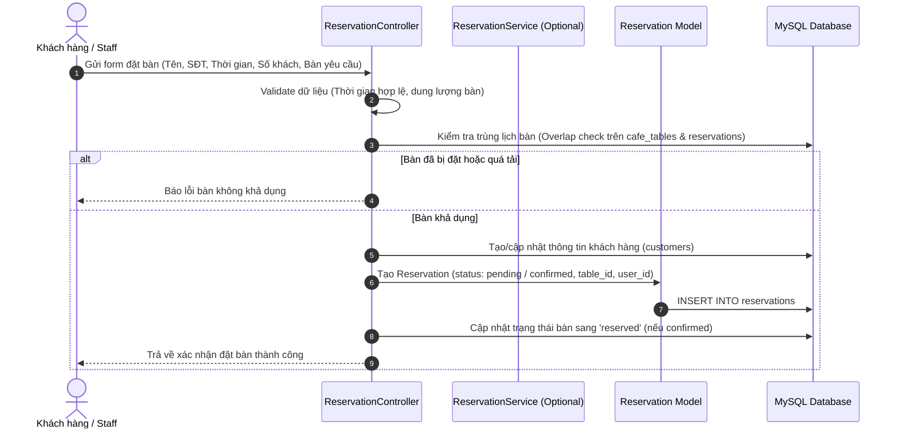
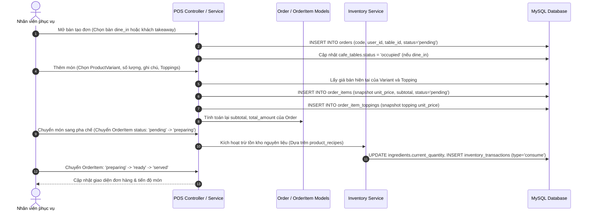
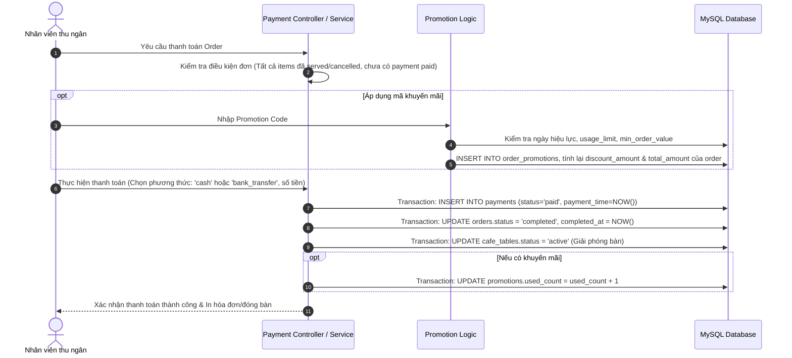

# BÁO CÁO RÀ SOÁT TOÀN DIỆN NGHIỆP VỤ VÀ HỆ THỐNG
## COFFEE SHOP MANAGEMENT SYSTEM

* **Vai trò thực hiện:** Business Analyst + Software Analyst + Laravel Developer
* **Ngày lập báo cáo:** 22/09/2026
* **Đối tượng khảo sát:** Toàn bộ tài liệu (`requirements.md`, `architecture.md`, `database-design.md`, `frontend.md`, `plan.md`, `AGENTS.md`) và toàn bộ Source Code/Database Schema (`app/`, `routes/`, `database/migrations/`, `resources/views/`, `resources/js/`, `resources/css/`).
* **Nguyên tắc thẩm định:** Căn cứ 100% trên bằng chứng thực tế (tài liệu đã duyệt, file mã nguồn, bảng cơ sở dữ liệu, model, route, view). Không suy diễn theo khuôn mẫu dự án phổ biến.

---

## 1. TỔNG QUAN HỆ THỐNG

### 1.1 Hệ thống dùng để làm gì?
* **[FACT - Nguồn `requirements.md` §2, §3, `architecture.md` §2]:** Hệ thống là ứng dụng web quản lý và vận hành ban đầu cho một địa điểm quán cà phê (Single-location coffee shop). Hệ thống cung cấp khu vực nội bộ dành cho nhân viên/quản lý vận hành và các trang công khai dành cho khách hàng xem thông tin quán và thực đơn.
* **[FACT - Nguồn `requirements.md` §8, §9]:** Phạm vi nghiệp vụ chính gồm: Xác thực nội bộ, quản lý người dùng, quản lý khu vực & bàn, quản lý đặt bàn (reservation), quản lý thực đơn (danh mục, sản phẩm, biến thể, topping), vận hành đơn hàng (order tại bàn/mang về), ghi nhận thanh toán, quản lý khuyến mãi, quản lý nguyên liệu & tồn kho, dashboard thống kê vận hành & doanh thu, và website công khai (landing page, menu). Các tính năng chuỗi chi nhánh, chấm công, tính lương, mua hàng nhà cung cấp, kế toán nâng cao, giao hàng (delivery) và sàn TMĐT hoàn toàn nằm ngoài phạm vi (Out of Scope).

### 1.2 Đối tượng / Người dùng & Actor/Role trong hệ thống
* **[FACT - Nguồn `requirements.md` §4, `database-design.md` §6.1, §6.2]:** Hệ thống quy định chính xác **3 Actor / Role**:

| Actor / Role | Định danh kỹ thuật | Mục đích & Trách nhiệm chính | Bằng chứng tài liệu & Code |
| :--- | :--- | :--- | :--- |
| **Admin** | `users.role = 'admin'` | Quản trị viên toàn quyền: quản lý tài khoản nội bộ (`users`), cấu hình khu vực & bàn (`areas`, `cafe_tables`), quản lý thực đơn (`categories`, `products`, `product_variants`, `toppings`), cấu hình công thức món (`product_recipes`), quản lý nguyên liệu & điều chỉnh kho (`ingredients`, `inventory_transactions`), quản lý khuyến mãi (`promotions`), giám sát đơn hàng & thanh toán, xem dashboard/báo cáo doanh thu & vận hành. | `requirements.md` §4.1; `database-design.md` §6.1; `app/Models/User.php` |
| **Staff** | `users.role = 'staff'` | Nhân viên vận hành quán: đăng nhập khu vực nội bộ, xem sơ đồ & trạng thái bàn, tạo/cập nhật đơn hàng (`orders`, `order_items`), hỗ trợ ghi nhận/tiếp nhận đặt bàn (`reservations`), thực hiện ghi nhận thanh toán tiền mặt/chuyển khoản (`payments`), theo dõi tiến độ pha chế/phục vụ món. | `requirements.md` §4.2; `database-design.md` §6.1; `app/Models/User.php` |
| **Customer** | Khách vãng lai / `customers` | Khách hàng của quán: Xem thông tin quán, xem thực đơn công khai không cần tài khoản; gửi yêu cầu đặt bàn trước (liên kết qua bảng `customers` để lưu thông tin liên hệ: tên, số điện thoại, email, ngày sinh). Khách hàng phiên bản đầu **không bắt buộc có tài khoản đăng nhập**. | `requirements.md` §4.3; `database-design.md` §6.2; `app/Models/Customer.php`; `resources/views/public/home/index.blade.php` |

---

## 2. DANH SÁCH TOÀN BỘ NGHIỆP VỤ ĐÃ PHÁT HIỆN

Dưới đây là bảng rà soát toàn bộ các nghiệp vụ theo từng nhóm chức năng, kèm bằng chứng hiện hữu và trạng thái xác định thực tế:

| STT | Nhóm nghiệp vụ | Nghiệp vụ cụ thể | Actor | Mô tả chi tiết | Bằng chứng thực tế | Trạng thái |
| :---: | :--- | :--- | :---: | :--- | :--- | :---: |
| **1** | **Authentication & Authorization** | Đăng nhập nội bộ (Admin/Staff) | Admin, Staff | Xác thực tài khoản email/mật khẩu, cập nhật `last_login_at`, cấp quyền theo role `admin`/`staff`. | `requirements.md` FR-01; `database-design.md` §6.1 (`users.role`, `status`); `app/Models/User.php`. (Route/Controller chưa tạo). | **Đã có yêu cầu & schema, chưa có code Controller/Route** |
| **2** | **Authentication & Authorization** | Phân quyền truy cập theo vai trò | Admin, Staff | Chặn Staff truy cập module Admin (User, Promo, Recipe, Dashboard); chặn Guest vào khu vực vận hành. | `requirements.md` §7, FR-01, FR-02; `plan.md` Phase 4 (`CAFE-AUTH-BE-003/004`). | **Đã có yêu cầu & cấu trúc, chưa có Middleware** |
| **3** | **Quản lý người dùng nội bộ** | Quản lý tài khoản Admin & Staff | Admin | Thêm, sửa, vô hiệu hóa (`status: active/inactive`), xóa mềm (`deleted_at`) tài khoản nội bộ. | `requirements.md` FR-02; `database-design.md` §6.1; Migration `0001_01_01_000000_create_users_table.php`; `app/Models/User.php`. | **Đã có schema & Model, chưa có Controller/Blade** |
| **4** | **Quản lý khách hàng** | Lưu trữ thông tin khách hàng đặt bàn / gọi món | System / Staff | Ghi nhận tên, số điện thoại, email, sinh nhật khách hàng khi đặt bàn hoặc tạo đơn; không hỗ trợ điểm tích lũy trong v1. | `database-design.md` §6.2; Migration `2026_08_14_000001_create_customers_table.php`; `app/Models/Customer.php`. | **Đã có schema & Model, chưa có Controller/Blade** |
| **5** | **Quản lý bàn & khu vực** | Cấu hình khu vực quán (Areas) | Admin | Tạo, sửa tên/mô tả, trạng thái hoạt động của khu vực (trong nhà, ngoài trời, ban công...). | `requirements.md` FR-03; `database-design.md` §6.3; Migration `2026_08_14_000002_create_areas_table.php`; `app/Models/Area.php`. | **Đã có schema & Model, chưa có Controller/Blade** |
| **6** | **Quản lý bàn & khu vực** | Quản lý danh sách bàn & sơ đồ bàn (Cafe Tables) | Admin, Staff | Quản lý mã bàn, tên bàn, sức chứa (`capacity`), liên kết khu vực (`area_id`), trạng thái bàn (`active`, `occupied`, `reserved`, `inactive`). | `requirements.md` FR-03; `database-design.md` §6.8; Migration `2026_08_14_000006_create_cafe_tables_table.php`; `app/Models/CafeTable.php`. | **Đã có schema & Model, chưa có Controller/Blade** |
| **7** | **Quản lý thực đơn (Menu)** | Quản lý danh mục món (Categories) | Admin | Quản lý danh mục, thứ tự hiển thị (`display_order`), ảnh minh họa, trạng thái. | `requirements.md` FR-05; `database-design.md` §6.4; Migration `2026_08_14_000003_create_categories_table.php`; `app/Models/Category.php`. | **Đã có schema & Model, chưa có Controller/Blade** |
| **8** | **Quản lý thực đơn (Menu)** | Quản lý sản phẩm (Products) | Admin | Quản lý mã sản phẩm, tên, mô tả, ảnh, danh mục. Giá bán không lưu ở Product mà lưu ở Variant. | `requirements.md` §5.4, FR-05; `database-design.md` §6.9; Migration `2026_08_14_000007_create_products_table.php`; `app/Models/Product.php`. | **Đã có schema & Model, chưa có Controller/Blade** |
| **9** | **Quản lý thực đơn (Menu)** | Quản lý biến thể kích cỡ & giá bán (Product Variants) | Admin | Quản lý kích cỡ (`regular`, `medium`, `large`), giá bán tương ứng (`price`), trạng thái còn/hết hàng (`available`/`unavailable`). | `requirements.md` §5.4; `database-design.md` §6.10; Migration `2026_08_16_000014_create_product_variants_table.php`; `app/Models/ProductVariant.php`. | **Đã có schema & Model, chưa có Controller/Blade** |
| **10** | **Quản lý thực đơn (Menu)** | Quản lý Topping dùng chung | Admin | Quản lý danh sách topping (trân châu, thạch, kem cheese...), đơn giá topping, trạng thái (`available`/`unavailable`). | `requirements.md` §5.4; `database-design.md` §6.5; Migration `2026_08_14_000004_create_toppings_table.php`; `app/Models/Topping.php`. | **Đã có schema & Model, chưa có Controller/Blade** |
| **11** | **Nghiệp vụ Đặt bàn (Reservation)** | Tiếp nhận & Quản lý đặt bàn | Staff, Customer, Admin | Ghi nhận yêu cầu đặt bàn: thời gian (`reservation_time`), số khách (`guest_count`), yêu cầu đặc biệt (`special_request`), liên kết bàn & khách hàng, chuyển trạng thái vòng đời: `pending` → `confirmed` → `seated` → `completed` (hoặc `cancelled` + `cancelled_reason`). | `requirements.md` §5.3, FR-04; `database-design.md` §6.11; Migration `2026_08_16_000015_create_reservations_table.php`; `app/Models/Reservation.php`. | **Đã có schema & Model, chưa có Controller/Blade** |
| **12** | **Nghiệp vụ Đơn hàng (Order / POS)** | Tạo & quản lý đơn hàng (Dine-in / Takeaway) | Staff | Tạo đơn hàng gắn bàn (`dine_in`) hoặc mang đi (`takeaway`), gán nhân viên phụ trách, mã đơn, tính tổng tiền tự động (`subtotal`, `discount_amount`, `tax_amount`, `total_amount`), trạng thái đơn (`pending`, `completed`, `cancelled`). | `requirements.md` §5.5, FR-06, FR-07; `database-design.md` §6.13; Migration `2026_08_16_000016_create_orders_table.php`; `app/Models/Order.php`. | **Đã có schema & Model, chưa có Controller/Blade** |
| **13** | **Nghiệp vụ Đơn hàng (Order / POS)** | Thêm món & Quản lý tiến độ món (Order Items) | Staff | Thêm biến thể sản phẩm vào đơn, snapshot đơn giá (`unit_price`), tính `subtotal` món, ghi chú pha chế, chuyển trạng thái tiến độ món: `pending` → `preparing` → `ready` → `served` (hoặc `cancelled`). | `requirements.md` §5.5, FR-06; `database-design.md` §6.14; Migration `2026_08_16_000017_create_order_items_table.php`; `app/Models/OrderItem.php`. | **Đã có schema & Model, chưa có Controller/Blade** |
| **14** | **Nghiệp vụ Đơn hàng (Order / POS)** | Thêm Topping vào món đã chọn | Staff | Gắn một hoặc nhiều topping vào từng order item, snapshot đơn giá topping tại thời điểm bán (`order_item_toppings.unit_price`). | `requirements.md` §5.5; `database-design.md` §6.18; Migration `2026_08_16_000018_create_order_item_toppings_table.php`; `app/Models/OrderItemTopping.php`. | **Đã có schema & Model, chưa có Controller/Blade** |
| **15** | **Nghiệp vụ Thanh toán (Payment)** | Xử lý thanh toán đơn hàng | Staff | Ghi nhận phương thức thanh toán (`cash`, `bank_transfer`), số tiền, mã giao dịch (`transaction_id`), thời gian thanh toán, trạng thái (`pending`, `paid`, `failed`, `refunded`). Tối đa 1 payment `paid` cho 1 order, không hỗ trợ split payment v1. | `requirements.md` §5.6, FR-08; `database-design.md` §6.15; Migration `2026_08_16_000019_create_payments_table.php`; `app/Models/Payment.php`. | **Đã có schema & Model, chưa có Controller/Blade** |
| **16** | **Nghiệp vụ Khuyến mãi (Promotion)** | Quản lý mã khuyến mãi & Áp dụng giảm giá | Admin, Staff | Quản lý chương trình khuyến mãi: loại giảm (`percentage`, `fixed`), giá trị giảm, đơn tối thiểu (`min_order_value`), mức giảm tối đa (`max_discount`), thời hạn (`start_date`, `end_date`), giới hạn lượt dùng (`usage_limit`, `used_count`). Lưu lịch sử áp dụng tại `order_promotions` (tối đa 1 voucher/order). | `requirements.md` §5.7, FR-09; `database-design.md` §6.7, §6.16; Migration `2026_08_14_000008` & `2026_08_16_000020`; `app/Models/Promotion.php`, `OrderPromotion.php`. | **Đã có schema & Model, chưa có Controller/Blade** |
| **17** | **Quản lý Tồn kho & Định mức (Inventory)** | Quản lý danh mục nguyên liệu | Admin | Quản lý tên nguyên liệu, đơn vị tính (`unit`), định mức tồn tối thiểu (`min_quantity`), số lượng tồn hiện tại (`current_quantity`), cảnh báo tồn kho thấp. | `requirements.md` §5.8, FR-10; `database-design.md` §6.6; Migration `2026_08_14_000005_create_ingredients_table.php`; `app/Models/Ingredient.php`. | **Đã có schema & Model, chưa có Controller/Blade** |
| **18** | **Quản lý Tồn kho & Định mức (Inventory)** | Quản lý công thức định lượng (Recipes) | Admin | Thiết lập định mức nguyên liệu tiêu hao cho từng biến thể món (`product_variant_id` + `ingredient_id` + `quantity`). | `requirements.md` §5.8; `database-design.md` §6.12; Migration `2026_08_16_000021_create_product_recipes_table.php`; `app/Models/ProductRecipe.php`. | **Đã có schema & Model, chưa có Controller/Blade** |
| **19** | **Quản lý Tồn kho & Định mức (Inventory)** | Ghi nhận biến động kho & Trừ kho tự động | Admin / System | Ghi nhận lịch sử giao dịch kho (`import`, `consume`, `adjustment`, `waste`), số lượng trước/sau, người thực hiện (`user_id`). Tự động trừ kho khi món chuyển sang `preparing` (qua morph `reference_type: 'order_item'`). Không cho phép tồn âm. | `requirements.md` §5.8, FR-10; `database-design.md` §6.17; Migration `2026_08_16_000022`; `app/Providers/AppServiceProvider.php`; `app/Models/InventoryTransaction.php`. | **Đã có schema, Model & Morph Map; chưa có Service/Controller** |
| **20** | **Báo cáo & Thống kê (Dashboard)** | Tổng quan doanh thu & vận hành | Admin | Thống kê tổng doanh thu, số lượng đơn hàng, món bán chạy, chỉ số vận hành bàn/tồn kho theo kỳ. | `requirements.md` §5.9, FR-11; `database-design.md` §4 (đọc từ transactional tables, không có bảng riêng). | **Đã có yêu cầu, chưa có code Controller/View** |
| **21** | **Website công khai (Public Landing)** | Trang chủ giới thiệu quán & Preview menu | Customer | Hiển thị thông điệp quán, câu chuyện thương hiệu, preview 3 món tiêu biểu, khung giờ ưu đãi buổi chiều, nút kêu gọi đặt bàn (mailto link), menu navigation responsive cho mobile/desktop. | `requirements.md` FR-12, FR-13; `routes/web.php` (GET `/`); `resources/views/public/home/index.blade.php`; `resources/js/app.js`; `resources/css/public/coffee-theme.css`. | **ĐÃ TRIỂN KHAI HOÀN CHỈNH (Giao diện tĩnh)** |
| **22** | **Website công khai (Public Menu)** | Xem thực đơn chi tiết công khai | Customer | Khách hàng xem danh mục món, giá bán các biến thể và topping mà không cần đăng nhập. | `requirements.md` FR-12; `plan.md` Phase 12 (`CAFE-PUBLIC-FE-002`). Thư mục `resources/views/public/menu/` đã có `.gitkeep`. | **Đã có yêu cầu & schema, chưa có Controller/Blade data-driven** |

---

## 3. TRUY NGƯỢC TỪ NGHIỆP VỤ ↔ IMPLEMENTATION

Dưới đây là ma trận ánh xạ chi tiết từng thành phần kỹ thuật trong kiến trúc Laravel MVC đối với tất cả 22 nghiệp vụ:

| STT | Nghiệp vụ | Route | Controller | Model | Database Table / Migration | View (Blade) | JS / AJAX / CSS | Middleware / Auth | Validation |
| :---: | :--- | :--- | :--- | :--- | :--- | :--- | :--- | :--- | :--- |
| 1 | Đăng nhập nội bộ | *Chưa đăng ký* (chuẩn bị tại `routes/web.php`) | *Chưa có* (`app/Http/Controllers/Auth/`) | `User` (`app/Models/User.php`) | `users` (`0001_01_01_000000_create_users_table.php`) | *Chưa có* (`resources/views/auth/`) | *Chưa có* | Cấu hình Auth guard chuẩn Laravel | *Chưa có* (dự kiến FormRequest) |
| 2 | Phân quyền truy cập | *Chưa có* | *Chưa có* | `User` | `users.role` (`admin`, `staff`) | *Chưa có* | *Chưa có* | *Chưa có* (Cần tạo Role Middleware) | *Chưa có* |
| 3 | Quản lý người dùng nội bộ | *Chưa có* (chuẩn bị tại `routes/admin.php`) | *Chưa có* (`app/Http/Controllers/Admin/`) | `User` | `users` | *Chưa có* (`resources/views/admin/users/`) | *Chưa có* | `auth`, `role:admin` | *Chưa có* |
| 4 | Quản lý khách hàng | *Chưa có* | *Chưa có* | `Customer` (`app/Models/Customer.php`) | `customers` (`2026_08_14_000001_create_customers_table.php`) | *Chưa có* (`resources/views/admin/customers/`) | *Chưa có* | `auth` | *Chưa có* |
| 5 | Quản lý khu vực quán | *Chưa có* | *Chưa có* | `Area` (`app/Models/Area.php`) | `areas` (`2026_08_14_000002_create_areas_table.php`) | *Chưa có* (`resources/views/admin/areas/`) | *Chưa có* | `auth`, `role:admin` | *Chưa có* |
| 6 | Quản lý bàn & sơ đồ bàn | *Chưa có* (admin + staff) | *Chưa có* | `CafeTable` (`app/Models/CafeTable.php`) | `cafe_tables` (`2026_08_14_000006_create_cafe_tables_table.php`, `2026_08_16_000012`) | *Chưa có* (`resources/views/admin/tables/`, `staff/tables/`) | *Chưa có* | `auth` | *Chưa có* |
| 7 | Quản lý danh mục thực đơn | *Chưa có* | *Chưa có* | `Category` (`app/Models/Category.php`) | `categories` (`2026_08_14_000003_create_categories_table.php`) | *Chưa có* (`resources/views/admin/categories/`) | *Chưa có* | `auth`, `role:admin` | *Chưa có* |
| 8 | Quản lý sản phẩm | *Chưa có* | *Chưa có* | `Product` (`app/Models/Product.php`) | `products` (`2026_08_14_000007_create_products_table.php`, `2026_08_16_000013`) | *Chưa có* (`resources/views/admin/products/`) | *Chưa có* | `auth`, `role:admin` | *Chưa có* |
| 9 | Quản lý biến thể kích cỡ & giá | *Chưa có* | *Chưa có* | `ProductVariant` (`app/Models/ProductVariant.php`) | `product_variants` (`2026_08_16_000014_create_product_variants_table.php`) | *Chưa có* | *Chưa có* | `auth`, `role:admin` | *Chưa có* |
| 10 | Quản lý Topping | *Chưa có* | *Chưa có* | `Topping` (`app/Models/Topping.php`) | `toppings` (`2026_08_14_000004_create_toppings_table.php`, `2026_08_16_000009`) | *Chưa có* | *Chưa có* | `auth`, `role:admin` | *Chưa có* |
| 11 | Nghiệp vụ Đặt bàn | *Chưa có* (Staff/Admin/Public) | *Chưa có* | `Reservation` (`app/Models/Reservation.php`) | `reservations` (`2026_08_16_000015_create_reservations_table.php`) | *Chưa có* (`resources/views/staff/reservations/`) | *Chưa có* | Optional public / `auth` staff | *Chưa có* |
| 12 | Nghiệp vụ Đơn hàng (Order) | *Chưa có* (chuẩn bị tại `routes/staff.php`) | *Chưa có* (`app/Http/Controllers/Staff/`) | `Order` (`app/Models/Order.php`) | `orders` (`2026_08_16_000016_create_orders_table.php`) | *Chưa có* (`resources/views/staff/orders/`) | *Chưa có* (`resources/js/order/`) | `auth`, `role:staff` | *Chưa có* |
| 13 | Quản lý Order Items | *Chưa có* | *Chưa có* | `OrderItem` (`app/Models/OrderItem.php`) | `order_items` (`2026_08_16_000017_create_order_items_table.php`) | *Chưa có* | *Chưa có* | `auth`, `role:staff` | *Chưa có* |
| 14 | Thêm Topping vào Order Item | *Chưa có* | *Chưa có* | `OrderItemTopping` (`app/Models/OrderItemTopping.php`) | `order_item_toppings` (`2026_08_16_000018_create_order_item_toppings_table.php`) | *Chưa có* | *Chưa có* | `auth`, `role:staff` | *Chưa có* |
| 15 | Nghiệp vụ Thanh toán | *Chưa có* | *Chưa có* | `Payment` (`app/Models/Payment.php`) | `payments` (`2026_08_16_000019_create_payments_table.php`) | *Chưa có* (`resources/views/staff/payments/`) | *Chưa có* | `auth`, `role:staff` | *Chưa có* |
| 16 | Quản lý & Áp dụng Khuyến mãi | *Chưa có* | *Chưa có* | `Promotion`, `OrderPromotion` | `promotions`, `order_promotions` (`2026_08_14_000008`, `2026_08_16_000011`, `2026_08_16_000020`) | *Chưa có* (`resources/views/admin/promotions/`) | *Chưa có* | `auth`, `role:admin` | *Chưa có* |
| 17 | Quản lý nguyên liệu tồn kho | *Chưa có* | *Chưa có* | `Ingredient` (`app/Models/Ingredient.php`) | `ingredients` (`2026_08_14_000005_create_ingredients_table.php`, `2026_08_16_000010`) | *Chưa có* (`resources/views/admin/ingredients/`) | *Chưa có* | `auth`, `role:admin` | *Chưa có* |
| 18 | Quản lý công thức món | *Chưa có* | *Chưa có* | `ProductRecipe` (`app/Models/ProductRecipe.php`) | `product_recipes` (`2026_08_16_000021_create_product_recipes_table.php`) | *Chưa có* | *Chưa có* | `auth`, `role:admin` | *Chưa có* |
| 19 | Ghi nhận biến động & trừ kho | *Chưa có* | *Chưa có* (cần Service) | `InventoryTransaction` | `inventory_transactions` (`2026_08_16_000022_create_inventory_transactions_table.php`) | *Chưa có* | *Chưa có* | `AppServiceProvider` (`enforceMorphMap`) | *Chưa có* |
| 20 | Dashboard & Thống kê | *Chưa có* | *Chưa có* | Truy vấn tổng hợp `Order`, `Payment`, `OrderItem` | *Đọc từ transactional tables* | *Chưa có* (`resources/views/admin/dashboard/`) | *Chưa có* | `auth`, `role:admin` | *Chưa có* |
| 21 | Landing page công khai | `GET /` (`routes/web.php:5-7`) | Closure trả về View | *Không sử dụng Model* (nội dung tĩnh) | *Không truy vấn DB* | `resources/views/public/home/index.blade.php`, `layouts/public.blade.php`, 4 blade components | `resources/js/app.js`, `coffee-theme.css`, `components.css` | Public (Không cần auth) | N/A |
| 22 | Xem thực đơn công khai | *Chưa có route* | *Chưa có* | `Category`, `Product`, `ProductVariant`, `Topping` | `categories`, `products`, `product_variants`, `toppings` | *Chưa có* (`resources/views/public/menu/`) | *Chưa có* | Public | N/A |

---

## 4. XÁC ĐỊNH CÁC LUỒNG NGHIỆP VỤ CHÍNH

Dựa trên thiết kế dữ liệu đã đóng băng (`database-design.md`), quy tắc nghiệp vụ (`requirements.md`) và cấu trúc kiến trúc (`architecture.md`), các luồng nghiệp vụ chuẩn được đặc tả như sau:

### 4.1 Luồng 1: Đặt bàn (Reservation Lifecycle Flow)

* **Chi tiết trạng thái:** `pending` → `confirmed` → `seated` (chuyển bàn sang `occupied` và tạo `order`) → `completed` (sau khi thanh toán & trả bàn) hoặc `cancelled` (ghi nhận `cancelled_reason`).

---

### 4.2 Luồng 2: Tạo đơn hàng, Gọi món & Tiến độ pha chế (Order & POS Flow)

---

### 4.3 Luồng 3: Áp dụng Khuyến mãi, Thanh toán & Đóng đơn (Payment & Checkout Flow)

---

## 5. ĐỐI CHIẾU TÀI LIỆU VÀ SOURCE CODE

### 5.1 Bảng đối chiếu tổng hợp

| Nghiệp vụ / Module | Có trong tài liệu | Có trong code | Kết luận phân tích |
| :--- | :---: | :---: | :--- |
| **Hạ tầng Cơ sở dữ liệu (18 bảng nghiệp vụ)** | **Có** (`database-design.md`) | **Có** (25 file migrations) | **Đã triển khai đầy đủ & chính xác** (18 bảng, đúng kiểu dữ liệu DECIMAL/ENUM, khóa ngoại RESTRICT, soft deletes, morph maps). |
| **Eloquent Model Foundation (18 Base + 18 Custom Models)** | **Có** (`architecture.md`, `plan.md`) | **Có** (`app/Models/`) | **Đã triển khai đầy đủ** (Cấu trúc kế thừa Base/Custom, khai báo relationships, casts, fillables đầy đủ). |
| **Giao diện Landing Page công khai (`/`)** | **Có** (`requirements.md`, `frontend.md`) | **Có** (`resources/views/public/home/`) | **Đã triển khai hoàn chỉnh** (Blade view, layout, responsive CSS, mobile navigation JS). |
| **Xác thực Đăng nhập/Đăng xuất (Auth)** | **Có** (`requirements.md` FR-01) | **Chưa** (Chỉ có Model `User`, chưa có Route/Controller/View) | **Có trong yêu cầu nhưng chưa triển khai** (Thuộc Phase 4 theo kế hoạch). |
| **Phân quyền Role-based (Admin/Staff Middleware)** | **Có** (`requirements.md` §7) | **Chưa** (Chưa có Middleware class) | **Có trong yêu cầu nhưng chưa triển khai** (Thuộc Phase 4 theo kế hoạch). |
| **Quản trị Master Data (Khu vực, Bàn, Danh mục, Sản phẩm, Topping)** | **Có** (`requirements.md` FR-02, 03, 05) | **Chưa** (Chỉ có DB Migration + Model, chưa có Controller/Blade) | **Có trong yêu cầu nhưng chưa triển khai** (Thuộc Phase 5 theo kế hoạch). |
| **Vận hành POS / Đơn hàng (Order, Order Items, Toppings)** | **Có** (`requirements.md` FR-06, 07) | **Chưa** (Chỉ có DB Migration + Model, chưa có Controller/JS/Blade) | **Có trong yêu cầu nhưng chưa triển khai** (Thuộc Phase 6 theo kế hoạch). |
| **Thanh toán (Payment cash/transfer)** | **Có** (`requirements.md` FR-08) | **Chưa** (Chỉ có DB Migration + Model, chưa có Controller/Blade) | **Có trong yêu cầu nhưng chưa triển khai** (Thuộc Phase 7 theo kế hoạch). |
| **Đặt bàn (Reservation Staff & Public)** | **Có** (`requirements.md` FR-04) | **Chưa** (Chỉ có DB Migration + Model, chưa có Controller/Blade) | **Có trong yêu cầu nhưng chưa triển khai** (Thuộc Phase 8 theo kế hoạch). |
| **Quản lý & Áp dụng Khuyến mãi (Promotion)** | **Có** (`requirements.md` FR-09) | **Chưa** (Chỉ có DB Migration + Model, chưa có Controller/Blade) | **Có trong yêu cầu nhưng chưa triển khai** (Thuộc Phase 9 theo kế hoạch). |
| **Quản lý Định mức & Biến động Kho (Inventory & Recipes)** | **Có** (`requirements.md` FR-10) | **Chưa** (Chỉ có DB Migration, MorphMap & Model, chưa có Service/Controller) | **Có trong yêu cầu nhưng chưa triển khai** (Thuộc Phase 10 theo kế hoạch). |
| **Dashboard & Báo cáo doanh thu (Dashboard)** | **Có** (`requirements.md` FR-11) | **Chưa** (Chưa có Controller/View) | **Có trong yêu cầu nhưng chưa triển khai** (Thuộc Phase 11 theo kế hoạch). |
| **Trang thực đơn công khai động (`/menu`)** | **Có** (`requirements.md` FR-12) | **Chưa** (Chưa có Route/Controller/View động) | **Có trong yêu cầu nhưng chưa triển khai** (Thuộc Phase 12 theo kế hoạch). |

---

## 6. PHÂN LOẠI 4 NHÓM NGHIỆP VỤ

### Nhóm A: Đã xác nhận (Có bằng chứng rõ ràng trong tài liệu và source code)
1. **[FACT] Schema Cơ sở dữ liệu 18 bảng nghiệp vụ:**
   * Khẳng định: Toàn bộ 18 bảng nghiệp vụ đã được thiết kế chuẩn (`database-design.md`) và hiện thực chính xác qua 25 migration files trong `database/migrations/`.
2. **[FACT] Eloquent Models Layer:**
   * Khẳng định: 18 Base Models (`app/Models/Base/`) và 18 Custom Models (`app/Models/`) đã hiện thực toàn bộ quan hệ 1:N, N:M, casts kiểu số thập phân, soft deletes và morph map `order_item` trong `AppServiceProvider`.
3. **[FACT] Frontend Foundation & Landing Page công khai:**
   * Khẳng định: Route `GET /`, layout `public.blade.php`, view `public/home/index.blade.php`, 4 Blade components, CSS theme `coffee-theme.css` và JS toggle menu `app.js` đã hoạt động hoàn chỉnh.

### Nhóm B: Có trong yêu cầu nhưng chưa triển khai trong code
1. **[FACT] Xác thực & Phân quyền nội bộ (Auth / Role Middleware):** Cần cho Admin và Staff (Phase 4).
2. **[FACT] CRUD Quản trị dữ liệu Master Data:** Khu vực, Bàn, Danh mục, Sản phẩm, Biến thể, Topping (Phase 5).
3. **[FACT] POS / Order Management Core:** Tạo đơn, gọi món, hủy món, tính tổng tiền, quản lý trạng thái món (Phase 6).
4. **[FACT] Xử lý Thanh toán (Payment):** Ghi nhận tiền mặt / chuyển khoản, hoàn tất đơn, giải phóng bàn (Phase 7).
5. **[FACT] Đặt bàn nội bộ & công khai (Reservation):** Form tiếp nhận, kiểm tra xung đột bàn, đổi trạng thái đặt bàn (Phase 8).
6. **[FACT] Quản lý & Áp dụng Khuyến mãi (Promotion):** Quản trị voucher, kiểm tra điều kiện áp dụng cho đơn (Phase 9).
7. **[FACT] Tồn kho & Định lượng công thức (Inventory & Recipes):** Quản trị nguyên liệu, công thức pha chế, trừ tồn kho tự động khi pha chế (Phase 10).
8. **[FACT] Dashboard & Thống kê doanh thu:** Thống kê doanh thu, đơn hàng, món bán chạy cho Admin (Phase 11).
9. **[FACT] Trang thực đơn công khai động (Dynamic Public Menu):** Hiển thị danh sách món lấy trực tiếp từ database (Phase 12).

### Nhóm C: Có trong source code nhưng tài liệu chưa mô tả
* **[FACT] Không có nghiệp vụ "mồ côi" nào:** Không tìm thấy bất kỳ route, controller, hay logic nào được viết trong source code mà nằm ngoài tài liệu `requirements.md` và `database-design.md`. Mọi file thư mục (`app/Http/Controllers/Admin`, `Staff`, `Auth`, `app/Services`, `resources/views/admin`, `staff`, `auth`) đều đang ở dạng khung chờ (.gitkeep) được đồng bộ tuyệt đối với Roadmap (`plan.md`).

### Nhóm D: Chưa đủ bằng chứng / Cần làm rõ (TBD)
1. **[FACT - Nguồn `requirements.md` §12]:** Chính sách chi tiết về hủy đặt bàn, phí cọc hoặc giới hạn thời gian giữ bàn (hiện tại `reservations` mới chỉ có trạng thái cơ bản và `cancelled_reason`).
2. **[FACT - Nguồn `requirements.md` §12]:** Quy định phân bổ thuế/phụ phí và chiết khấu phức tạp (hiện tại `tax_amount` mặc định 0, `order_promotions` lưu mức giảm trực tiếp).
3. **[FACT - Nguồn `requirements.md` §12]:** Quy trình xử lý hoàn tiền (Refund) hoặc điều chỉnh hóa đơn sau thanh toán (Schema bảng `payments` đã có enum `refunded`, nhưng luồng nghiệp vụ hoàn tiền chi tiết chưa được định nghĩa).

---

## 7. RÀ SOÁT KHOẢNG TRỐNG VÀ ĐÁNH GIÁ CHUYÊN MÔN

### 7.1 Kết quả kiểm tra tính toàn vẹn (Integrity Check)
1. **Route không có Controller xử lý:**
   * **[FACT]:** Route `/` gọi trực tiếp Closure trả về View tĩnh.
   * **[FACT]:** `routes/admin.php` và `routes/staff.php` hiện mới là file khung rỗng, chưa đăng ký route nào.
2. **Controller / Service rỗng:**
   * **[FACT]:** Toàn bộ thư mục `app/Http/Controllers/Admin`, `Staff`, `Auth`, `Public` và `app/Services` mới chỉ có file `.gitkeep`. Chưa có controller action hay service method nào được hiện thực.
3. **Bảng Database chưa có nghiệp vụ sử dụng:**
   * **[FACT]:** Không có bảng nào dư thừa. Toàn bộ 18 bảng đều có quan hệ mật thiết và phục vụ chính xác 9 business domains đã được duyệt trong SRS v1.2 Frozen.
4. **Phân quyền / Middleware:**
   * **[FACT]:** Bảng `users` đã có trường `role` (`admin`, `staff`) và `status` (`active`, `inactive`), nhưng ứng dụng chưa tạo Custom Middleware (ví dụ: `CheckRole`, `EnsureAdmin`, `EnsureStaff`) để bảo vệ routes.
5. **Giao diện người dùng (Blade Views):**
   * **[FACT]:** Chỉ mới có giao diện trang chủ công khai `resources/views/public/home/index.blade.php`. Các thư mục view nội bộ (`admin/*`, `staff/*`, `auth/*`) mới là thư mục khung chờ.

---

## 8. KẾT LUẬN VÀ ĐỀ XUẤT (RECOMMENDATIONS)

### 8.1 Trả lời câu hỏi trọng tâm: "Dự án này thực sự đang có những nghiệp vụ gì?"
* **[FACT]:** Hệ thống đã hoàn thành **100% phần Nền tảng Dữ liệu và Thiết kế Kiến trúc** (Phase 0 đến Phase 3): 18 bảng cơ sở dữ liệu hoàn chỉnh, 18 cặp Base/Custom Models chuẩn mực Laravel Eloquent, cùng giao diện Landing Page công khai tĩnh.
* **[FACT]:** Hệ thống **chưa bắt đầu triển khai các nghiệp vụ ứng dụng động (Backend Controllers, Services, Requests, Internal Views)** (từ Phase 4 trở đi).

### 8.2 Đề xuất lộ trình tiếp theo (Theo đúng `plan.md`)
1. **[RECOMMENDATION] Bước 1 (Phase 4 - Auth):** Triển khai xác thực nội bộ Admin/Staff: Form đăng nhập, `AuthenticatedSessionController`, xử lý trạng thái tài khoản `active/inactive` và xây dựng Middleware phân quyền `admin` / `staff`.
2. **[RECOMMENDATION] Bước 2 (Phase 5 - Master Data):** Triển khai giao diện và API CRUD cho Admin: Quản lý khu vực & bàn, Quản lý danh mục & sản phẩm thực đơn (hỗ trợ biến thể kích cỡ và topping).
3. **[RECOMMENDATION] Bước 3 (Phase 6 & 7 - POS Order & Payment):** Triển khai màn hình POS cho nhân viên: Chọn bàn, tạo order, gọi món, quản lý tiến độ pha chế, áp dụng giảm giá và xác nhận thanh toán tiền mặt/chuyển khoản.
4. **[RECOMMENDATION] Bước 4 (Phase 8 - Reservation):** Triển khai màn hình tiếp nhận và quản lý đặt bàn nội bộ, kiểm tra trùng lặp bàn và form gửi yêu cầu đặt bàn công khai.
5. **[RECOMMENDATION] Bước 5 (Phase 9 & 10 - Promotion & Inventory):** Xây dựng Service trừ kho tự động khi món chuyển `preparing` và engine áp dụng khuyến mãi.
6. **[RECOMMENDATION] Bước 6 (Phase 11 & 12 - Dashboard & Public Menu):** Xây dựng Dashboard báo cáo doanh thu quản lý và trang thực đơn công khai động lấy dữ liệu từ database.

---
*Báo cáo được lập trên tinh thần khách quan, trung thực với hiện trạng mã nguồn và tài liệu của dự án.*
